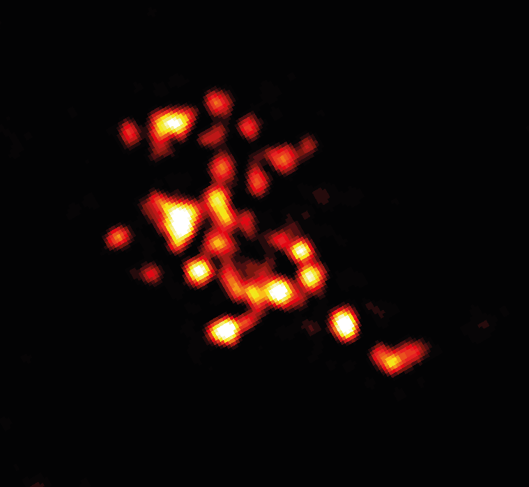

# recordName

> This is the feed's ID which can be letters, numbers, or dashes. Spaces are not allowed. Maximum length is 15 characters.

micro-nano-bio

# displayName

> This is the title of the custom feed. Maximum length is 24 characters.

Micro Nano Bio

# description

> This is the description of the feed.

Bluesky feed on anything micro or nano relating to Life Sciences. Posts on cell biology, molecular biology, biophysics, nanobiotechnology etc and many others welcome. 

# searchTerms

> There are three types of search terms:
>
> - Keywords: Test these in [https://bsky.app/search](https://bsky.app/search). `AND` is implicit, so `light microscopy` on one line will require both `light` and `microscopy`. You can use quotes as well `"light microscopy"`.
> - Users: links such as `https://bsky.app/profile/why.bsky.team` will pull in the user's posts. To include replies and reposts, you can add the following flags: `https://bsky.app/profile/why.bsky.team +replies +reposts`.
> - Pinned posts: links such as `https://bsky.app/profile/scattercushion.bsky.social/post/3jxo32cwqlv2r` will pin at the top of the feed. One link per line, please.

> Users
- https://bsky.app/profile/nanomicroscopy.bsky.social
- https://bsky.app/profile/singmolsci.bsky.social

> keywords
- https://bsky.app/profile/ijayas.bsky.social/post/3k2xdjygwjz2q
- microscopy
- nanoscale
- super resolution
- single molecule
- localization microscopy
- SMLM
- STORM
- DNA-PAINT
- MINFLUX
- Cryo-EM
- molecular
- cellular
- nanotechnology
- "expansion microscopy"
- FRET
- bacterial
- pathogen
- genetic
- proteomice
- genomic
- transcription factor
- omic
- membrane
- organelle
- mitochondrial
- intracellular
- extracellular
- biomolecular
- RNA
- DNA

# safeMode

> Safe mode limits the total number of API calls coming from Cloudflare.
>
> Set to `false` if you have higher limits via a paid Cloudflare plan.

true

# avatar

> This must link to an image (PNG or JPEG) in the same directory as this CONFIG.md. It doesn't have to be called `avatar.png`, but just be sure this CONFIG.md points to the correct file.

